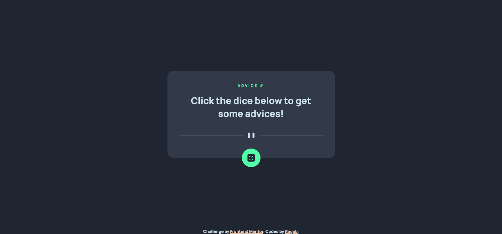
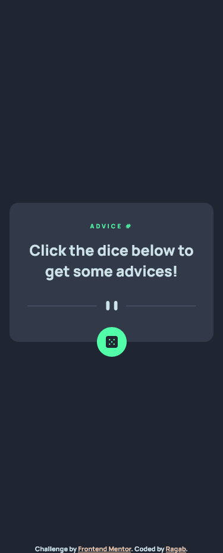

# Frontend Mentor - Advice generator app solution

This is a solution to the [Advice generator app challenge on Frontend Mentor](https://www.frontendmentor.io/challenges/advice-generator-app-QdUG-13db). Frontend Mentor challenges help you improve your coding skills by building realistic projects.

## Table of contents

- [Overview](#overview)
  - [The challenge](#the-challenge)
  - [Screenshot](#screenshot)
  - [Links](#links)
  - [Built with](#built-with)
  - [What I learned](#what-i-learned)
  - [Continued development](#continued-development)
- [Author](#author)

## Overview

### The challenge

Users should be able to:

- View the relevant dropdown menus on desktop and mobile when interacting with the navigation links
- View the optimal layout for the content depending on their device's screen size
- See hover states for all interactive elements on the page

### Screenshot

### Links

- Live Site URL: [@Github Pages](https://ragabogaa.github.io/advice)
- Solution URL: [@Frontend Mentor](https://www.frontendmentor.io/solutions/advice-generator-using-fetch-api-A4LThO6Wq0)

### Built with

- Semantic HTML5 markup
- CSS custom properties
- Flexbox
- Fetch API with JavaScript

### What I learned

Used Fetch in JS to get data and show it in the DOM

### Continued development

Need to work more on my JS skills

## Author

- Website - [Ragaboga](https://github.com/RagaBoGaa)
- Frontend Mentor - [@RagaBoGaa](https://www.frontendmentor.io/profile/RagaBoGaa)
